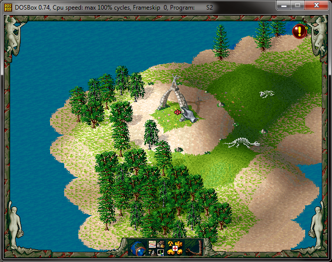

# Cheats

The code to activate cheats is `WINTER` (or `THUNDER` in versions earlier than 1.51). You can type this anytime to turn cheats on/off. When you have cheats on you can see an icon with exclamation in the top right corner of the screen:


The cheat enables you to build any building during campaign games. You can also build free headquarters outside your borders, just hit any free space that could hold a building (only works in Gold Edition & Mission CD!). In campaign games it acts just like a new empty storehouse, but on unlimited play you get the same merchandise as when starting the game.

By hitting F7 in the cheat mode you can view the whole map. The speed can also be changed more efficiently: ALT + 1 … ALT + 6 will set the game speed where higher value means more speed.

## Enable all Roman Campaign missions


1. Open `SAVE\MISSION.DAT` with a text editor
2. Replace contents with "1111111111"
3. Or to reset back to normal: "1100000000"

## Enable all World Campaign missions

1. Open `SAVE\MISSION2.DAT` with a hex editor
2. Replace all bytes with hex 01

## Change starting ressources

You can edit the .rtx files in the directory `SETTLERS2\DATA\MISSIONS` as per below:

```
    !ADD_WARE   0   20
    !ADD_WARE   1   50
    !ADD_WARE   2   46
```
```
    !ADD_PEOPLE   0   100
    !ADD_PEOPLE   1     4
    !ADD_PEOPLE   2     2
```

    Notice you can change people 0 (unemployed guys) to 199.

## See whole map

Play Settlers 2 in "Campaign mode", start a game, save it.  Then start a Free Game and DISABLE (off) exploration.  Reload the previously saved game and you'll be able to see the whole map.