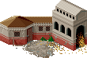
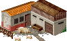
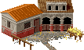
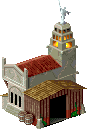
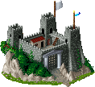
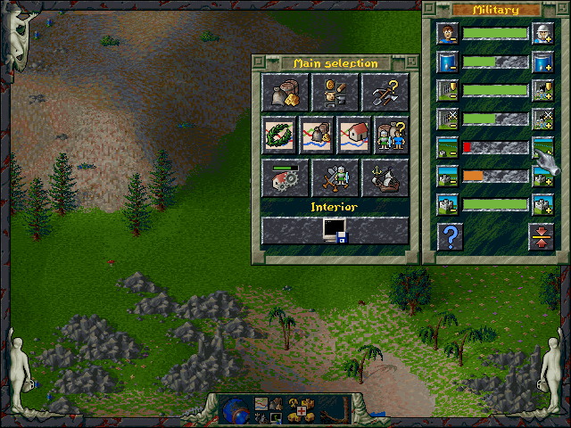

Castles
=======

The biggest buildings available, castles need and consume a lot of space.
It also takes a fair amount of time to construct these buildings.

Farm
----

You need a lot of farms. Whenever you don’t need anything else, you probably want to build farms. There is often not enough space available and so these buildings make sure you need to expand and sometimes chop down entire forests just to be able to see all those nice grain fields appearing around a farm.

Also, make sure those farmer-hated foresters don’t come close! Foresters are very keen to plant trees where-ever there is space available and that does include the surroundings of a farm. Atleast foresters don’t plant their trees in the middle of a growth season…

.. list-table:: Detailed Information

  * - Icon
    - Cost
    - Requires
    - In/Out
  * - |farm|
    - | |boards| |boards| |boards|
      | |stone| |stone| |stone|
    - | Farmer
      | Scythe
    - | -
      | Grain

Pig farm
--------

Meat. Just give grain and water and the pigs are happy.

.. list-table:: Detailed Information

  * - Icon
    - Cost
    - Requires
    - In/Out
  * - |pigfarm|
    - | |boards| |boards| |boards|
      | |stone| |stone| |stone|
    - | Pig breeder (Worker)
      | -
    - | Grain, Water
      | Meat

Donkey breeder
--------------

Donkeys are the extra transport you often want to have. They double the rate of flag-to-flag transportation, being very important for your core routes. However on sea missions you may wish not to have any donkeys as the game appears to behave buggily when donkeys are available, transporting the donkeys from harbor to harbor.

.. list-table:: Detailed Information

  * - Icon
    - Cost
    - Requires
    - In/Out
  * - |donkeybreeder|
    - | |boards| |boards| |boards|
      | |stone| |stone| |stone|
    - | Donkey breeder (Worker)
      | -
    - | Grain, Water
      | Donkey

Harbor
------

Harbors are the troublesome building of the game. They require you to play the game in a certain way to avoid bugs related to how the harbors work. There are a few things to pay attention to:

1. **Remember**: order you give will be executed, **no matter how long it takes**.
2. Do not **connect roads** to a new harbor until the building is finished!
3. Do not remove already constructed roads **unless** the road is already manned.
4. You may remove the roads only after all the geologists and scouts have fully done their work. Do not call multiple geologists/scouts or **wait** until all the geologists/scouts have come. If you call multiple geologists/scouts they will eventually come, but it will often take a lot of time for all of them to do so.
5. **Donkeys love travelling overseas “for no reason”!** Don’t build donkey breeders (or very carefully control the amount of breeded donkeys).
6. Don’t disconnect military buildings from the road system. If a military building is holding too many soldiers and you want to get rid of it, build barracks to replace it and then **destroy it**.
7. **Do not stop storage** of any tools or goods in a harbor. The only exceptions are beer, shields and swords.
8. Do not start an expedition unless you already have a total of **four boards, six stones** and a **builder** available.
9. If possible, connect islands with boats. This will help with transportation and decreases issues with ships.
10. Three ships is enough! Otherwise they will get in each others way.
11. It is a good idea to store (all) food in harbors.
12. It is also good if you have extra raw minerals (coal, gold, iron ore).
13. Keep tools always available in your headquarters/home island. The game looks for this location first.

.. Note:: In addition to this you may have noticed that you cannot place harbors in custom created maps. **The harbor is only available during the campaign mission**. Also, a map must be manually hacked to include a special coastal castle tile upon which a harbor can be built. Such tile is identified by **an anchor**.

This means that in order to play a custom map with ships you must do the following:

+ Replace ``DATA\MAPS\MISS200.WLD`` with a renamed SWD map.
+ The SWD map must be manipulated to have coastal castle tiles.
+ **Map generator** provided at `GOG`_ and on this site can do this manipulation: open the map file in the map generator (File menu > Open), then click Tools menu > Coastal castle fix and it’ll automatically identify all castle tiles that are on coast line, changing them into coastal castle tiles.
+ You must also modify ``MISSION\MIS_0000.RTX`` so that enemy headquarters positions are correct. You can check the map’s default enemy positions in the map generator, or you can use Blue Byte’s map editor and mark the positions on paper. Other changes may also be required.

.. list-table:: Detailed Information

  * - Icon
    - Cost
    - Requires
    - In/Out
  * - |harbor|
    - | |boards| |boards| |boards| |boards|
      | |stone| |stone| |stone| |stone| |stone| |stone|
    - | -
      | -
    - | Ship
      | Expedition

Fortress
--------

The mightiest of the might and hardest to conquer, fortress is the ultimate structure in which to train your soldiers. For this reason it is also the most construction materials consuming and longest building structure in the game. Gold coins are hardly wasted in a fortress as at best four soldiers upgrade with just one coin! A perfectionist can make optimal usage of a fortress and after few initial coins will always gain the best upgrade value for each gold coin.

It is possible to control how much military you have available in all buildings, however only roughly based on how close the military building is to enemy border. When a flag has no line, the building is an **interior building**. The default settings only send one soldier to each military building, and only two into a fortress.

Closer to enemy you will see a single in the flag, stating “middle of country” in the game’s terms when it actually means a military building that is attackable by enemy in ideal conditions.

Finally, there are the military buildings that face the enemy borders. These have a cross in the flag and are rated as “border areas” in the game’s terms, but really means “very close to another player”.

Controlling how many soldiers are sent to each building is controlled based on these flags, and the setting can be changed directly in the military window:

|military_interior|

You can find the game’s finger cursor on the button that increases the Interior area’s soldiers. Setting this to maximum will make all military buildings with a **white flag** to have the maximum amount of soldiers of each type of building.

The button below it will increase the amount of soldiers in **line flagged** buildings. The final button controls **cross flag** buildings. So yes, you can make your military to almost fully abandon your crucial border structures, if you wish so!

Controlling these values can be used to optimize the training of your soldiers. For example, having one safe fortress next to a mint will most likely have the mint provide all it’s gold coins first to that fortress, meaning it makes a lot of sense to have as many soldiers there as possible. A perfectionist can use this to carefully maintain perfect use of each single coin, in some cases gaining superior army full of general level soldiers.

.. list-table:: Detailed Information

  * - Icon
    - Cost
    - Requires
    - In/Out
  * - |fortress|
    - | |boards| |boards| |boards| |boards|
      | |stone| |stone| |stone| |stone| |stone| |stone| |stone|
    - | Soldier x 9
      | Sword, Shield, Beer
    - | Gold coin
      | Soldier upgrade

.. |boards| image:: ../../Images/boards.png
  :alt: 🪵

.. |stone| image:: ../../Images/stone.png
  :alt: 🪨

.. _GOG: https://www.gog.com/
