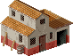

Houses
======

Medium sized buildings that fit in most open spaces.

Sawmill
-------

This building is one that you want to complete as quickly as possible. Three sawmills is a very good startup amount that will often make sure you always have enough boards available for building. Roughly ten woodcutters is enough to keep all three sawmills at full production. Remember you don’t need to build all ten woodcutters in one go and you can start building just two sawmills at first.

.. list-table:: Detailed Information

  * - Icon
    - Cost
    - Requires
    - In/Out
  * - |sawmill|
    - | |boards| |boards|
      | |stone| |stone|
    - | Carpenter
      | Saw
    - | Log
      | Board

Slaughterhouse
--------------

There is nothing spectacularly special about this building. Just make sure it is close enough to a pig farm and not too far away from mines or a storehouse. One slaughterhouse per pig farm is enough, although it doesn’t hurt to have one extra pig farm compared to the amount of slaughterhouses.

.. list-table:: Detailed Information

  * - Icon
    - Cost
    - Requires
    - In/Out
  * - |slaughterhouse|
    - | |boards| |boards|
      | |stone| |stone|
    - | Butcher
      | Cleaver
    - | Meat
      | Ham

Mill
----

A good amount of mills is the number of bakeries + 1.

.. list-table:: Detailed Information

  * - Icon
    - Cost
    - Requires
    - In/Out
  * - |mill|
    - | |boards| |boards|
      | |stone| |stone|
    - | Miller (Worker)
      | -
    - | Grain
      | Flour

Bakery
------

Keep this building close to a mill or a storehouse. Distance to the mines shouldn’t be to big either to keep the transportation of bread efficient.

.. list-table:: Detailed Information

  * - Icon
    - Cost
    - Requires
    - In/Out
  * - |bakery|
    - | |boards| |boards|
      | |stone| |stone|
    - | Baker
      | Rolling pin
    - | Flour, Water
      | Bread

Iron smelter
------------

This building processes iron ore to iron. A recommended amount of iron smelters is the amount of metalworks and armories combined + 1 extra.

.. list-table:: Detailed Information

  * - Icon
    - Cost
    - Requires
    - In/Out
  * - |ironsmelter|
    - | |boards| |boards|
      | |stone| |stone|
    - | Iron founder
      | Crucible
    - | Coal, Iron ore
      | Iron

Metalworks
----------

Metalworks produces the tools you need to have more specialist workers. Often having just one is enough. You may also wish to set transporting priorities so that metalworker has stuff to do: normally armory is prioritized over metalworks.

.. list-table:: Detailed Information

  * - Icon
    - Cost
    - Requires
    - In/Out
  * - |metalworks|
    - | |boards| |boards|
      | |stone| |stone|
    - | Metalworker
      | Hammer
    - | Board, Iron
      | Tools

Armory
------

Armorer builds more swords and shields for your new soldiers.

.. list-table:: Detailed Information

  * - Icon
    - Cost
    - Requires
    - In/Out
  * - |armory|
    - | |boards| |boards|
      | |stone| |stone|
    - | Armorer
      | Tongs
    - | Coal, Iron
      | Shield, Sword

Mint
----

Mint is a very important military building as it provides the funding of the training of your soldiers. You might think having a mint close to a fortress is a good idea, but remember any tool or resource transported by your worker will be lost permanently upon enemy soldier closing by, and you may even lose your fortress, in which case you really want to have your mint somewhere else.

.. list-table:: Detailed Information

  * - Icon
    - Cost
    - Requires
    - In/Out
  * - |mint|
    - | |boards| |boards|
      | |stone| |stone|
    - | Minter
      | Crucible
    - | Coal, Gold
      | Gold coin

Shipyard
--------

Shipwright builds your boats and ships. Most often you don’t really need boats as they are quite inferior routes, only able to transport goods, the distance of a boat route is limited while still being so long you easily end up having a traffic jam if you’re too dependant of a boat route.

It is a good idea to let shipwright simply build ships only. But there is a catch: if you have too many ships they often only end up getting in each others way! A recommended amount of ships is three. So once you have three ships, or a maximum of four, simply destroy your shipyard as you need nothing more of it. Or just don’t let him get his resources if you like to have the building sitting on your screen.

.. list-table:: Detailed Information

  * - Icon
    - Cost
    - Requires
    - In/Out
  * - |shipyard|
    - | |boards| |boards|
      | |stone| |stone| |stone|
    - | Shipwright
      | Hammer
    - | Board
      | Boat, Ship

Brewery
-------

Beer. Soldiers need beer. But only when recruited. Nobody wants to die voluntarily, but once they have your name on the paper you only live, and die, to serve your home nation.

Make sure all your shields, swords and beer and up in the same place. You can disallow any storehouse you wish to receive any further item and people of your choice.

.. list-table:: Detailed Information

  * - Icon
    - Cost
    - Requires
    - In/Out
  * - |brewery|
    - | |boards| |boards|
      | |stone| |stone|
    - | Brewer (Worker)
      | -
    - | Grain, Water
      | Beer

Storehouse
----------

Having more places to store your goods and inhabitants is important for one core reason: transportation times. When doing fine in the game you will eventually have more production than you have consumption, which means everything is transported to the closest storehouse. Likewise, when starting a new construction project it is better to get the materials from a nearby storehouse than from your headquarters that may be over half a map away!

.. list-table:: Detailed Information

  * - Icon
    - Cost
    - Requires
    - In/Out
  * - |storehouse|
    - | |boards| |boards| |boards| |boards|
      | |stone| |stone| |stone|
    - | -
      | -
    - | -
      | -

Watchtower
----------

A good place to train your soldiers as well a fair amount of protection, watchtower is a good building to build whenever building a fortress may be too costly or there is no space available. In some tactical situatations when you have the building speed advantage you may be able to crush enemy buildings under construction simply with the good radius of border expansion the watchtower provides. A watchtower builds almost as fast as a guardhouse, yet much slower than a barracks.

.. list-table:: Detailed Information

  * - Icon
    - Cost
    - Requires
    - In/Out
  * - |watchtower|
    - | |boards| |boards| |boards|
      | |stone| |stone| |stone|
    - | Soldier x 6
      | Sword, Shield, Beer
    - | Gold coin
      | Soldier upgrade

Catapult
--------

The ultimate defensive weapon, a catapult takes aim and attempts to kill enemy soldiers and military buildings consuming stone in the process. A catapult is not the fairest structures in the game. When placing a catapult one has to carefully consider which buildings the enemy is likely to attack first in case of an invasion. Also, multiple catapults at good distances of each other will make enemy’s life very difficult.

It is possible to avoid losing soldiers to catapults simply by destroying an occupied military building. At that point it is even ideal to wait for a catapult to shoot, as this will consume enemy stone for nothing.

.. list-table:: Detailed Information

  * - Icon
    - Cost
    - Requires
    - In/Out
  * - |catapult|
    - |boards| |boards| |boards| |boards|
    - | Worker
      | -
    - | Stone x 4
      | Swear words

.. |boards| image:: ../../Images/boards.png
  :alt: 🪵

.. |stone| image:: ../../Images/stone.png
  :alt: 🪨

.. |sawmill| image:: ../../Images/sawmill.png
  :alt: 🏠

.. |slaughterhouse| image:: ../../Images/slaughterhouse.png
  :alt: 🏠

.. |bakery| image:: ../../Images/bakery.png
  :alt: 🏠

.. |storehouse| image:: ../../Images/storehouse.png
  :alt: 🏠

