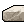
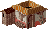
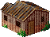
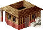
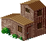
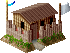
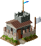
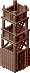
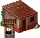

Huts
====

The smallest buildings which can be built almost everywhere except mountains, snow, swamps and lava (as much as that might suprise you!).

Woodcutter (Woodcutter / Axe)
-----------------------------

A woodcutter cuts any tree that his axe can hit. There are a few trees too tough for the axe, pine apples for an example. Woodcutter is also unable to walk to impassable snow or swamp, where there occasionally may be a few trees. He won’t go too far so you better have a forester nearby to plant more trees.

.. list-table:: Detailed Information

  * - Icon
    - Cost
    - Requires
    - In/Out
  * - |woodcutter|
    - |boards| |boards|
    - | Woodcutter
      | Axe
    - | Tree (terrain)
      | Log

Forester (Forester / Shovel)
----------------------------

A forester plants new trees. This means he eventually creates forests unless the trees are chopped down. This unique ability can be used to create protective buffer zones against enemy players who are too strong to be dealt with.

A balanced ratio of woodcutters and foresters is 5 to 2. This will keep woodcutters at 100%.

You should avoid having a forester too close of a farm, otherwise the forester may plant trees where a farmer would like to have a field!

.. list-table:: Detailed Information

  * - Icon
    - Cost
    - Requires
    - In/Out
  * - |forester|
    - |boards| |boards|
    - | Forester
      | Shovel
    - | -
      | Tree (terrain)

Stonemason (Pick-axe)
---------------------

Usually there is granite all over the map. Stonemason makes nice stones, consuming granite in the process. Eventually the map runs out of granite and there is only that much construction material availabe.

.. list-table:: Detailed Information

  * - Icon
    - Cost
    - Requires
    - In/Out
  * - |stonemason|
    - |boards| |boards|
    - | Stonemason
      | Pick-axe
    - | Granite (terrain)
      | Stone

Fisher (Fisher / Rod and line)
------------------------------

Fisher keeps fishing the coasts until no more fish can be found. Nature’s resources are limited!

.. list-table:: Detailed Information

  * - Icon
    - Cost
    - Requires
    - In/Out
  * - |fisher|
    - |boards| |boards|
    - | Fisher
      | Rod and line
    - | Fish (terrain)
      | Fish

Hunter (Hunter / Bow)
---------------------

Hunter keeps hunting animals as long as any wild animals can be found in the nearby territory.

.. list-table:: Detailed Information

  * - Icon
    - Cost
    - Requires
    - In/Out
  * - |hunter|
    - |boards| |boards|
    - | Hunter
      | Bow
    - | Animals (terrain)
      | Meat

Barracks (2 soldiers / Gold coin to upgrade)
--------------------------------------------

Two soldiers provide a minimal protection against enemy invasion. However barracks is ideal for quick expansion as building it requires only two items of boards. The territory claimed by barracks is minimal, but often will do very well considering how quick a barracks can be built.

.. Note:: | Barracks is the least efficient building to upgrade your soldiers.
          | Carefully consider whether you wish to allow Gold coins to be spent in your barracks and guardhouses! It is possible to disallow this.

.. Note:: | There is a cheat tactic that can be used with all military buildings: right before capture it is possible to burn down the building.
          | If your last soldier loses then you can simply destroy the building before enemy captures it. This ability to cheat has been removed in Return to the Roots remake.

.. list-table:: Detailed Information

  * - Icon
    - Cost
    - Requires
    - In/Out
  * - |barracks|
    - |boards| |boards|
    - | Soldier x 2
      | Sword, Shield, Beer
    - | Gold coin
      | Soldier upgrade

Guardhouse (3 soldiers / Gold coin to upgrade)
----------------------------------------------

A step up from barracks, a guardhouse takes much longer to build and requires three stones in addition to the three sets of boards. However the building only houses three soldiers, and since a watchtower only requires one boards and one stone more you may consider carefully which building to build.

.. list-table:: Detailed Information

  * - Icon
    - Cost
    - Requires
    - In/Out
  * - |guardhouse|
    - | |boards| |boards|
      | |stone| |stone| |stone|
    - | Soldier x 3
      | Sword, Shield, Beer
    - | Gold coin
      | Soldier upgrade

Lookout tower (Scout / Bow)
---------------------------

Provides intelligence and warnings on enemy activities, making more area visible around your borders. This building may be very useful in situatations where you know your enemy is more powerful than you as you can use a forester to block the enemy’s way while lookout tower reports of any enemy activity that still may come through, giving you extra time to think what to do.

.. list-table:: Detailed Information

  * - Icon
    - Cost
    - Requires
    - In/Out
  * - |lookouttower|
    - | |boards| |boards| |boards| |boards|
    - | Scout
      | Bow
    - | -
      | Visibility

Well (Worker)
-------------

You can find water almost everywhere on most maps. A geologist will bother you with found water up to the point you are utterly bored to see the message in the post office window.

Most often a good place to have a well is as close to storehouse as possible, as most often you produce more water than you need. If you intentionally keep water balanced then it is a good idea to have it close to bakeries, breweries, pig farms and donkey breeders.

.. list-table:: Detailed Information

  * - Icon
    - Cost
    - Requires
    - In/Out
  * - |well|
    - | |boards| |boards|
    - | Worker
      | -
    - | Water (terrain)
      | Water

.. |boards| image:: ../../Images/boards.png
  :alt: 🪵

.. |fisher| image:: ../../Images/fisher.png
  :alt: 🏠

