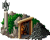

Mines
=====

Gold mine
---------

Unless near enemy territory, it does not make sense to have more than a few gold mines at a time as otherwise you’d also need to have a lot of mints and coal mines. Near enemy territory it is better to consume minerals as fast as possible as this reduces the amount of minerals your enemy may gain access to in case of successfully conquering your territory.

.. list-table:: Detailed Information

  * - Icon
    - Cost
    - Requires
    - In/Out
  * - |goldmine|
    - |boards| |boards| |boards| |boards|
    - | Miner
      | Pick-axe
    - | Bread, Fish, Ham
      | Gold

Iron mine
---------

Iron ore is a very requested resource, although it must first be processed to iron in iron smelter. You need iron to build tools and weapons, which are both crucial in specializing your workers.

.. list-table:: Detailed Information

  * - Icon
    - Cost
    - Requires
    - In/Out
  * - |ironmine|
    - |boards| |boards| |boards| |boards|
    - | Miner
      | Pick-axe
    - | Bread, Fish, Ham
      | Iron ore

Coal mine
---------

If iron is a requested resource, coal is very much so. You can’t process gold or iron ore without coal, let alone make weapons, which nearly triples the demand in comparison to gold and iron ore.

.. list-table:: Detailed Information

  * - Icon
    - Cost
    - Requires
    - In/Out
  * - |coalmine|
    - |boards| |boards| |boards| |boards|
    - | Miner
      | Pick-axe
    - | Bread, Fish, Ham
      | Coal

Granite mine
------------

In case you run low on granite deposits available on field, a granite mine may be your savior.

.. list-table:: Detailed Information

  * - Icon
    - Cost
    - Requires
    - In/Out
  * - |granitemine|
    - |boards| |boards| |boards| |boards|
    - | Miner
      | Pick-axe
    - | Bread, Fish, Ham
      | Stone

